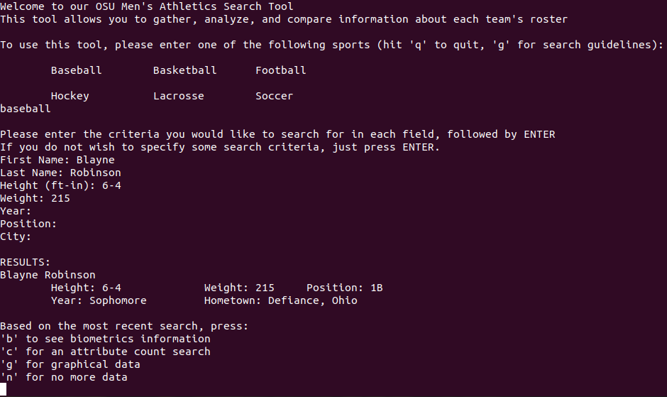

# Web Scraping

### Installations
* Before running this program, you must install bundler. On Windows or Ubuntu, run the command:
    * ```bundle install``` 
    * _Note:_ You may need to use the ```sudo``` command to install gems.
* **Ruby** must also be installed to run this program.



### Running our program
   * To run our program in the terminal, first ```cd``` in to the ```lib``` directory and use this command ```bundle exec ruby sports_scraper.rb```
   * Enter a sport from the list and search for a specific player, height, weight, position, year, and/or hometown.
   * If you are unfamiliar with OSU sports rosters, press enter all the way through the player, height, weight, position, year, and hometown and you will get the whole roster for that sport. This will be easier to test our functionality.
   * The results of your search will be displayed in the terminal.
   * Any graphs generated can be found in the ```graphs``` folder within the ```lib``` directory.
   * The program then prompts the user to input a letter 'b' (show biometrics info), 'c' (count attributes), 'g' (graph the data), 'n' (no more data).
   * Depending on the input, the program will display new data or no data then ask the user if they would like to see another sports team roster.
   * To quit, you can press 'q'.

### Functionality
   * Roster Search - you may search the roster of any of these sports: baseball, basketball, football, hockey, lacrosse, soccer. 
   * Graphs - the program will output graphs of the weight (bar graph) and positions (pie graph). 
   * Stats - after the search criteria, we display stats of the min, max, and average height/weight.
   * Attribute Count Search - after the search criteria, we count the number of players who have a certain attribute.

### Testing
   * To find our test cases, first ```cd``` in to the ```test``` directory. Then, run the ```ruby``` command on any test file.
   * Each of our test cases passed for every method that we tested.
   * We did not test our main ```sports_scraper.rb``` and ```graphs.rb``` because these classes our output was just printing the data.

### Contributions
- Jessica McNeill: Wrote the Readme file. Worked on football_news_scraper.rb and football_subscription.rb with Aiko. Helped make test cases for our methods. Cleaned up our files on Github and helped formalize comments.
- Aiko Zhao: Worked on football_news_scraper.rb and football_subscription.rb with Jessica. Created the roster_scraper_test.rb and stats_roster.rb test cases.
- Sarah Zhang: Wrote most of the main logic in sports_scraper.rb. Worked with Liam on the roster_stats.rb and roster_scraper.rb. Organized team meetings and researched more gems to use with Liam.
- Liam Gallagher: Wrote most of the logic in graphs.rb. Worked with Sarah on the roster_stats.rb and roster_scraper.rb. Fixed bugs in graphs.rb file. Researched gruff gem to create histograms for our data.
